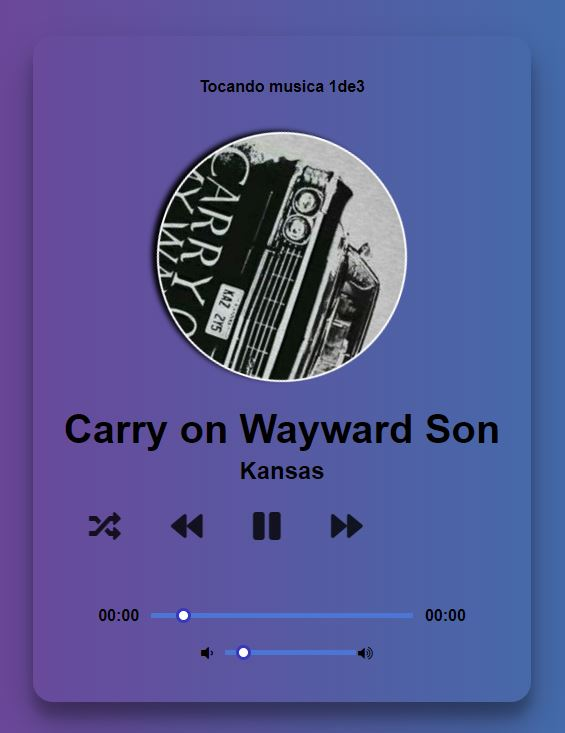

# :octocat: music_display 🎧




  #  :rocket: Sobre o Projeto

Music Player é um player de uma playlist ja existente.

### :loudspeaker: Features 

- [x] Readme
- [x] download musics and images
- [x] Events t players music local
- [x] HTML of the app
- [x] add two musics 
- [ ] search api


# :pushpin: Tecnologias Ultilizadas

- HTML /CSS
- JavaScript


# :pushpin: Como executar o projeto

  - Clone o repositoy 
  $ git clone <https://github.com/LysaKYoshikawa/music_display>
  
  - Editor de texto
  é desejavel que tenha um editor de texto como VSC
  
  - Abrir o documento
  Abra o editor de texto dentro da pasta onde salvou o clone do projeto
  
  - documento de extensão html
  Abra o documento de ```music``` em uma pagina html e se divirta!!! :snake:
  As setas fazem mexer a snake

# :pushpin: Author
Monalysa Klauck Yoshikawa
[Linkedin] : <https://www.linkedin.com/in/monalysa-yoshikawa/>
